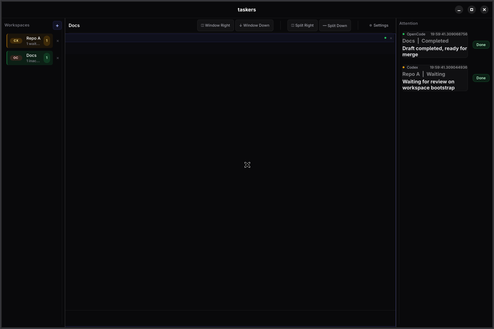
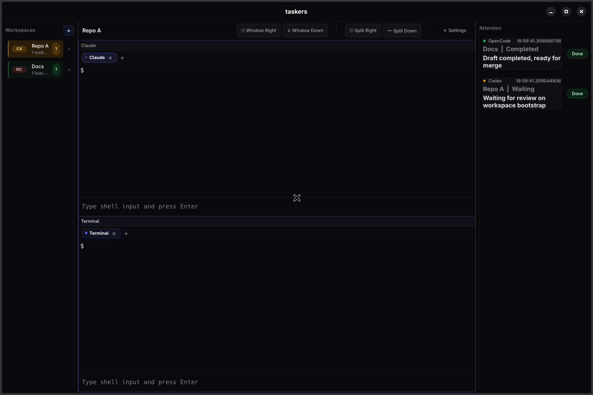

# taskers

`taskers` is an agent-first terminal workspace app scaffolded around a Linux-first Rust shell, a flexible terminal backend boundary, and a Niri-like tiling model for terminal workspaces.

It keeps per-agent status visible in the workspace strip, routes attention-worthy transitions into a dedicated sidebar, and lets terminal work stay organized as movable workspace windows instead of one giant split tree.

## Screenshots

Agent-aware workspace navigation and attention handling:



Split workspace layout with grouped panes inside a top-level workspace window:



## Tiling model

- Each workspace is a scrollable canvas of top-level terminal windows rather than one monolithic fullscreen split tree.
- Creating a new terminal window places it next to the active one in a cardinal direction, producing the same "keep moving through the workspace" feel as Niri-style tiling.
- Each top-level window owns its own split tree, so related panes stay grouped locally without flattening the whole workspace into one layout.
- Directional focus prefers neighboring top-level windows first, then falls back to pane-to-pane movement inside the active window.
- Workspace viewport position is persisted, and overview mode zooms the current workspace out to fit the full arrangement on screen.

## Workspace layout

- `taskers-domain`: UI-agnostic workspace, pane, layout, signal, and persistence model
- `taskers-control`: local control protocol, JSON framing, in-memory controller, and Unix socket server/client
- `taskers-runtime`: PTY/session foundation and explicit OSC signal parser
- `taskers-ghostty`: terminal backend abstraction and libghostty probe/fallback surface
- `taskers-cli`: CLI for querying and mutating the app over the local control socket
- `taskers-app`: GTK4/libadwaita shell that owns controller state, session persistence, and the local control socket

## Install from crates.io

```bash
cargo install taskers --locked
```

On Linux, the first launch bootstraps the version-matched Ghostty runtime bundle into your local XDG data directory when needed.

```bash
taskers --demo
```

## Quick start

```bash
cargo run -p taskers
```

```bash
cargo run -p taskers -- --demo
```

```bash
cargo run -p taskers-cli -- query status --socket /tmp/taskers.sock
```

```bash
cargo run -p taskers-cli -- pane new-window --workspace <workspace-id> --direction right
```

```bash
cargo run -p taskers-cli -- pane split --workspace <workspace-id> --axis vertical
```

## Repository setup

If you use `jj` in this repository, run the repo setup script once per clone:

```bash
./scripts/setup-jj.sh
```

The vendored Ghostty tree includes approved upstream assets larger than Jujutsu's default
1 MiB snapshot limit. The setup script raises the repo-local limit just enough to snapshot
the current vendored tree without changing your global `jj` behavior.

When refreshing `vendor/ghostty`, run the large-file check before pushing:

```bash
python3 scripts/check_ghostty_vendor_large_files.py
```

This fails if new files over 1 MiB appear outside the approved Ghostty allowlist, or if an
approved file grows past the repo-local `jj` limit.

## UI smoke test

Run the GTK/Ghostty smoke harness with:

```bash
python3 scripts/smoke_taskers_ui.py
```

This builds the local debug binaries, launches `taskers-app` under `Xvfb`, drives the app
through the existing control socket, and asserts that the rendered pane/layout state stays
consistent across pane split/close, workspace switch/close, and session restore.

## Install locally

```bash
cargo run -p taskers-cli -- install
```

This installs the `taskers` binary into Cargo's bin directory and writes a desktop entry plus icon into your local XDG application directories so it shows up in Linux app launchers.

## Current status

This foundation now includes:

- domain model for scrollable workspaces, top-level workspace windows, nested pane layout trees, attention state, and persistence snapshots
- explicit control protocol and Unix socket transport for workspace, window, pane, and viewport updates
- PTY spawning foundation and explicit OSC marker parsing
- GTK shell with live workspace switching, overview mode, directional workspace-window focus, split actions, autosave, agent-aware sidebars, and an app-hosted control server
- real shell sessions per terminal pane, with live output streaming and input-on-enter in the pane UI
- session load/save support with configurable session and socket paths, including persisted workspace viewport state
- registry installs that bootstrap the matching Ghostty runtime assets on first launch

The actual libghostty embedding work is intentionally isolated behind `taskers-ghostty` so the app shell and domain logic stay stable if the integration strategy changes.
